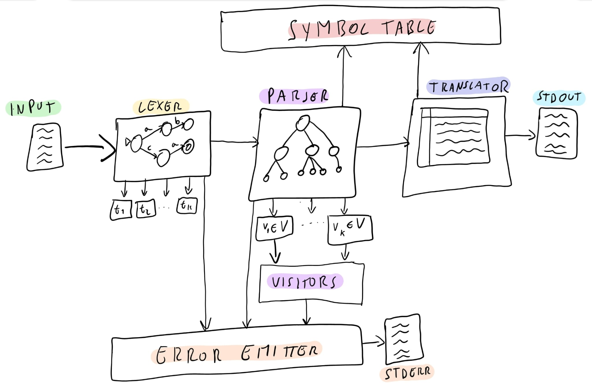

# Progetto Compilatori

---

$Francesco \space Pollarà$
$Giovanni \space Butera$

---

## Indice
- [Argomenti CLI](#argomenti-cli)
- [Strutture Dati](#strutture-dati)
- [Analisi Lessicale](#analisi-lessicale)
- [Analisi Sintattica](#analisi-sintattica)
- [Analisi Semantica](#analisi-semantica)
- [Sintesi](#sintesi)
- [Gestione degli Errori](#gestione-degli-errori)
- [Flusso di Esecuzione](#flusso-di-esecuzione)
- [Osservazioni](#osservazioni)
- [Appendice](#appendice)

---

### Argomenti CLI

Eseguendo il compilatore è possibile passare ad argomento (da command line) i seguenti comandi:
- '**--version**' o '**-v**' per conoscere ulteriori informazioni riguardo la versione attuale del software
- '**--help**' o '**-H**' per conoscere tutti i comandi opzionali possibili. Questo comando darà in risposta i comandi esposti in questa sezione
- '**--output**' o '**-o**' seguito da un file specificato tra parentesi angolari (del tipo <**path** | **filename**>) per specificare un file di output. Se il file non è specificato (e tutto va a buon fine) il file generato si chiamerà out.txt e si troverà nella stessa cartella in cui è stato invocato il compilatore

---

### Strutture Dati

Le strutture dati principali utilizzate nel compilatore sono due e si tratta di due **hash table** di differente tipo:
- Una **hash table** ad indirizzamento diretto, implementata con l'ausilio di un array in cui ogni indice rappresenta un elemento univoco. In questa **hash table** non è contemplato l'utilizzo di liste in caso di collisioni: nel caso di collisioni il token in input viene semplicemente scartato perché duplicato. Questa struttura dati è stata utilizzata per rappresentare una **symbol table** che riguardasse i ciclisti e che assegnasse ad ogni indice (indice = codice ciclista - 1) i valori utili in output, cioè la prima e l'ultima città visitata, il totale della distanza percorsa e il totale del tempo impiegato in secondi. Quest'ultimi due valori servono nel momento della stampa dell'output per calcolare la velocità media del ciclista.
- Una **hash table** implementata con tecnica del chaining. In questa **hash table** le collisioni sono gestite con l'ausilio di liste concatenate: nel caso di collisioni i valori in input vengono inseriti in coda alla lista corrispondente al codice hash. Inizialmente la capacità della struttura dati è settata a 0, nel momento in cui avviene l'inserimento del primo elemento allora la capacità viene settata a 16. Da lì in poi, la capacità verrà aumentata solo quando si supererà il load factor (settato a 0.75). Questa struttura dati è stata utilizzata per una **symbol table** che registrasse ogni città con il relativo codice, nome e coordinate. 

---

### Analisi Lessicale

L'analisi lessicale è stata svolta tramite l'utilizzo di flex. Sul file 'scanner.flex' sono state definite una serie di abbreviazioni e pattern utili al riconoscimento dei lessemi cui siamo interessati. In particolare modo i patterns **CITY_CODE**, **CITY_NAME**, **COORDINATES**, **CYCLIST_CODE**, **CYCLIST_NAME** e **SECONDS** sono gli unici i cui valori vengono salvati. Il resto dei patterns non hanno nessun valore a livello semantico e sono perlopiù utili come separatori di vario tipo durante l'analisi sintattica.

Vorremo porre l'attenzione sui patterns **CITY_NAME** e **CYCLIST_CODE** i quali sono formati a partire dal pattern **WORD**, ciò significa che le stringhe rappresentanti nomi verranno riconosciute a prescindere che il case delle lettere sia maiuscolo o meno.

---

### Analisi Sintattica

L'analisi sintattica viene svolta con l'ausilio di bison. Sul file 'parser.yy' sono definiti tutti i token a cui siamo interessati (con relativi tipi se necessario) nonché le regole di produzione utili proprio all'analisi sintattica.

L'assioma serve semplicemente per riconoscere grossolanamente la struttura del file da analizzare. Invece le regole di tipo section, in connubbio alle regole sec_continue, servono a riconoscere la struttura di una singola sezione (dove le sezioni sono: dichiarazioni città, dichiarazioni ciclisti e sezione statements). In ultimo, le regole di tipo sec_stmt sono le uniche regole che all'interno contengono token con attributi e dunque sono le uniche regole su cui è necessario effettuare analisi semantica. 

Per costruzione della grammatica, il linguaggio accetta file in input completamente vuoti ad eccezion fatta per i separatori di sezione '%%%'.

---

### Analisi Semantica

L'analisi semantica avviene con l'ausilio delle strutture dati menzionate in precedenza ed è svolta sezione per sezione. 

VisitSec1Stmt controlla che non ci siano errori nella dichiarazione delle città: non devono esistere città con codice duplicato. Quando un codice città viene letto, il software proverà ad inserirlo nella **symbol table** con chaining risultando in due possibili casi:
1. Il codice città non esiste nella **symbol table** quindi viene inserito insieme al suo nome e le sue coordinate.
2. Il codice città esiste già nella **symbol table** quindi non viene inserito e viene emesso un errore.

VisitSec2Stmt invece si occupa dell'inserimento dei ciclisti nella corrispettiva **symbol table** ad inserimento diretto. L'inserimento viene eseguito rispetto il codice ciclista che deve essere univoco. Prima dell'inserimento vengono effettuati i seguenti controlli:
1. Se il codice ciclista è già presente nella **symbol table** allora viene emesso un errore. Il duplicato viene scartato.
2. Se il codice ciclista non è presente nella **symbol table** ma la città di partenza non esiste nella rispettiva **hash table** allora viene emesso un errore. Il codice ciclista non viene inserito.

Se entrambi i controlli vengono superati (quindi il codice ciclista non esista già e la città è stata già dichiarata) allora il codice ciclista viene inserito insieme al suo nome, la sua città di inizio e la sua città di arrivo/fine che all'inizializzazione coincide con quella di partenza. Distanza e tempo vengono inizializzati a 0. Nella **symbol table** sono contemplati ciclisti omonimi ma non ciclisti con lo stesso codice

VisitSec3Stmt svolge i seguenti controlli semantici:
1. Quando viene letto un codice ciclista bisogna controllare che esso esista e non venga letto in questa sezione per la prima volta. Se il controllo fallisce allora viene emesso un errore.
2. Quando viene letto un codice città bisogna controllare che esso esista e che non venga letto in questa sezione per la prima volta. Se il controllo fallisce allora viene emesso un errore.
3. Quando viene letto un codice città bisogna controllare che esso non coincida con l'ultima città visitata dal ciclista. Se il controllo fallisce allora viene emesso un errore.

Se tutti i controlli vengono superati allora viene aggiornata la città d'arrivo del ciclista, nonchè la sua distanza totale percorsa e il tempo impiegato.

---

### Sintesi

Durante la sintesi ultimiamo la manipolazione dei dati per essere finalmente adatti all'output desiderato. In particolare vengono prelevati dalla relativa **hash table** i nomi delle città di partenza e d'arrivo tramite codice città e, inoltre, viene calcolata la velocità media del ciclista dividendo distanza per tempo. L'output stampato rispecchia quello richiesto nella consegna del progetto con l'unica aggiunta del codice ciclista accanto al nome per maggiore chiarezza in caso di omonimia.

La traduzione dei dati avviene iterando la **symbol table** con indirizzamento diretto e genera i dati con l'ausilio della **symbol table** con chaining.

---

### Gestione degli Errori

Il software utilizzato per l'architettura del compilatore mette a disposizione strumenti base per la diagnostica. Tuttavia, la robustezza di un compilatore non è data dalla sola ingegneria, bensì anche dagli strumenti di diagnostica che offre, in maniera tale da offire la migliore esperienza utente nel caso di errori di runtime.
Pertanto, abbiamo deciso di adottare una procedura di diagnostica personalizzata che rimpiazzasse quella base di Bison. Per fare ciò abbiamo utilizzato le funzioni che questo strumento ci mette a disposizione:
- **yysymbol_name()**: traduce il tipo (enumerazione) del token in stringa
- **yypcontext_token()**: ottiene il contesto del token attualmente processato
- **yypcontext_location()**: ottiene la posizione nel codice sorgente del token attualmente processato
- **yypcontext_expected_tokens()**: ottiene i token che il parser si aspettava in input durante una determinata regola di produzione che ha generato un errore di sintassi
- **yyreport_syntax_error()**: implementa la funzione di emissione degli errori di sintassi personalizzata (come specificato in precedenza).

**Osservazione**
La funzione **yypcontext_expected_tokens(ctx, buffer, N)** prende a parametri:
- il contesto del token processato attualmente
- un buffer di interi dove scrivere l'insieme dei token attesi
- la lunghezza del buffer dei token attesi

Per lunghezza del buffer basterebbe che **N** $= argmax_a|follow(a \in \Sigma \cup V)|$.
Nel caso della nostra grammatica basterebbe una lunghezza massima di $2$.

Il nostro strumento mette a disposizione tipologie di errori per la diagnostica:
- **errori lessicali**: emessi quando un carattere che non fa parte dell'insieme dei caratteri del linguaggio viene incontrato.
- **errori sintattici**: emessi dal parser quando viene incotrato un token inaspettato.
- **errori semantici**: emessi dai visitatori dell'albero sintattico quando una regola semantica non viene soddisfatta.

---

### Flusso di Esecuzione

---

### Osservazioni

Lungo la stesura del software sono state prese le seguenti scelte di design che influenzano l'analisi dei dati:
- Città e ciclisti vengono riconosciuti tramite codice, dunque il nome associato risulta irrilevante ai fini del riconoscimento. Sarà dunque possibile trovare casi di omonimia nei nomi delle città e dei ciclisti.
- I nomi delle città e dei ciclisti possono contenere un numero di parole potenzialmente infinito separate da spazi. I nomi di ciclisti devono contenere almeno due parole separate da spazi.
- I nomi delle città e dei ciclisti possono essere definite in qualsiasi case, maiuscolo o minuscolo. Non si hanno restrizioni del tipo "La prima lettera deve essere maiuscola"
- I file in input completamente vuoti, eccezion fatta per i separatori di sezione '%%%' che devono essere sempre presenti, sono accettati dalla grammatica del linguaggio.
- Per ogni tappa letta nella terza sezione, il codice della città corrispondente ad un determinato ciclista deve essere diverso dal codice dell'ultima città visitata dal ciclista.
- Codici città e codici ciclisti devono essere univoci.
- Codici città e codici ciclisti non possono essere ridichiarati: se si incontra un duplicato esso viene scartato
- La **symbol table** con indirizzamento diretto utilizzata per i ciclisti ha una grandezza fissa di 1000 entries. Abbiamo reputato che l'indirizzamento diretto (e quindi di tempo costante) fosse più importante di potenziali numerose entries vuote all'interno dell'array.

---

### Appendice
#### Riferimenti esterni
- [Flex](https://westes.github.io/flex/manual/)
- [Bison](https://www.gnu.org/software/bison/)
- [Bison, Report degli errori personalizzati](https://www.gnu.org/software/bison/manual/html_node/Syntax-Error-Reporting-Function.html)